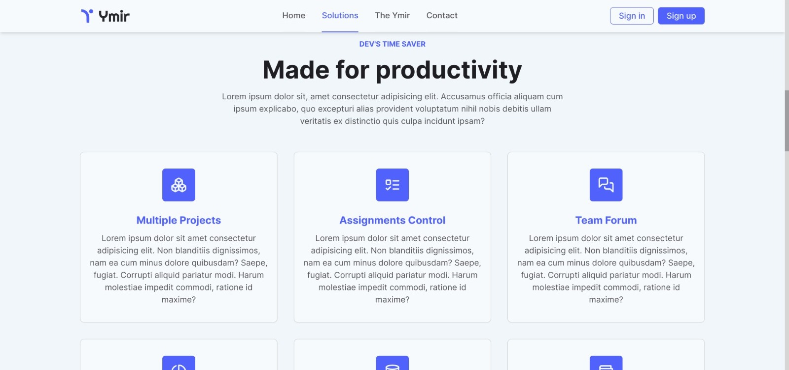

# Ymir

This app is built with Next.js 13, Tailwind, Prisma, Next Auth, Radix UI, Zustand, Tailwind and PlanetScale.

## ⚠️ Under development

This application was made for purpose of creating a shareable environment to work  on projects with teamates.

---

### Features

- It should be able to register and auth;
- It should be able to access project forum;
- It should be able to manage projects;
- It should be able to invite other users to a project;
- It should be able to create tasks;
- It should be able to create service with many rules;
- It should be able to create a pre database schema;
- It should be able to manage expenses;
- It should be able to get metrics;

#### Details
- Each user can have a maximum of 5 projects;
